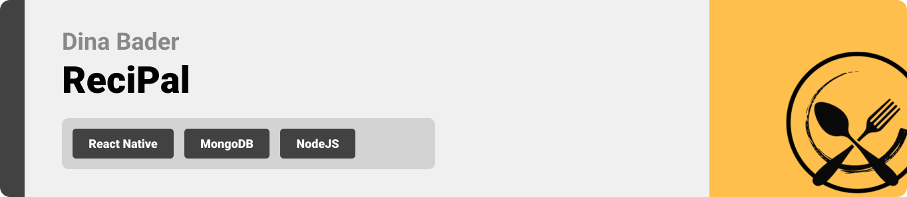

<br><br>

<!-- project philosophy -->


> A mobile app for getting recipes, making it easier for food lovers to get their favorite recipes without the hassle of searching online.
>
> ReciPal aims to streamline the cooking process by providing a user-friendly platform for customers to search for recipes and get recipes based on the ingrdients they have at home. We believe in enhancing the cooking experience by saving time and ensuring user satisfaction.

### User Stories
- As a user, I want to be able to get recipes based on the ingredients that I have at home.
- As a user, I want to have multiple languages, so I can translate the ingredients that I don't understand.
- As a user, I want to be able to save Recipes, so I that I don't have to search for the same recipe again.

- As a admin, I want to be able to see the statistics for the number of users and saved recipes .
- As a admin, I want to be able to add and remove recipes.
- As a admin, I want to be able to check user feedback so that I can offer a better user experience.

<br><br>
<!-- Tech stack -->


###  Recipal is built using the following technologies:

- This project uses the [React Native](https://reactnative.dev/docs/environment-setup) framework. React native is an open-source JavaScript framework, designed for building apps on multiple platforms like iOS, Android, and also web applications, utilizing the very same code base. It is based on React, and it brings all its glory to mobile app development.
- For persistent storage (database), the app uses the [MongoDB](https://www.mongodb.com) package which allows storing data in flexible, JSON-like documents, meaning fields can vary from document to document and data structure can be changed over time.
- The app uses the [Imagga](https://imagga.com) technologie for image recognition. Imagga offers powerful image recognition and tagging capabilities, allowing the application to analyze and understand the content of images with precision.
- For translation, the app uses [i18n](https://www.i18next.com) (internationalization). i18n provides a robust framework for managing translations and localizations within the application.

<br><br>
<!-- UI UX -->


> We designed ReciPal using wireframes and mockups, iterating on the design until we reached the ideal layout for easy navigation and a seamless user experience.


### Mockup Examples
| Home screen  | Settings Screen | Recipe Details Screen |
| ---| ---| ---|
|  |  |  |

- Check more Mockups on [figma](https://www.figma.com/file/77x4fDfFQlj0g2biaUPTjJ/Untitled?type=design&node-id=114%3A621&mode=design&t=sNpH2jnBRthMJnpY-1)

<br><br>

<!-- Database Design -->


<br><br>


<!-- Implementation -->


### User Screens (Mobile)
| Login screen  | Register screen | Landing screen |
| ---| ---| ---|
|  |  |  |

| Recipe Details screen  | Saved Screen | Awards Screen | 
| ---| ---| ---|
|  |  |  |

| Recommendation screen  | Languages Screen |
| ---| ---|
|  |  | 


### Admin Screens (Mobile)
| Home screen  | Feedback Screen |
| ---| ---|
|  |  | 
<br><br>


<!-- AWS Deployment -->


### 1. Download and install PuTTY
PuTTY is a free and open source terminal emulator that you will use to connect to your EC2 instance via SSH. You can download [PuTTY](https://www.chiark.greenend.org.uk/~sgtatham/putty/latest.html) and install it on your PC.

### 2. Connect to  EC2 instance via SSH
To SSH into your EC2 instance, use the SSH command in your terminal with the instance's Public DNS address and your private key (.pem) file. Make sure the permissions for the .pem file are set correctly. Then, run the SSH command with the -i flag followed by the path to your .pem file and the EC2 instance's username (ec2-user for Amazon Linux). This command grants you access to the instance's command line interface.

### 3. Install Git, Node, and NPM
Install Git, Node, and NPM on your EC2 instance.
```bash
   sudo yum update -y        

   sudo yum install git -y   

   curl -o- https://raw.githubusercontent.com/nvm-sh/nvm/v0.38.0/install.sh | bash 

   . ~/.nvm/nvm.sh           
   
   nvm install node          
```

### 4. Pull your project and run it
To pull your project and run it, you need to run the following commands:
```bash
cd your-project

git pull

npm start
```


<br><br>

<!-- Unit Testing -->


- This project employs rigorous unit testing methodologies to ensure the reliability and accuracy of code components. By systematically evaluating individual units of the software, we guarantee a robust foundation, identifying and addressing potential issues early in the development process.

| Registration Tests: New User Registration and Error Handling  |  Registration Test: Error Handling for Existing Email or Username  |
| ---| ---|
|  |  | 

| Login Test: Valid and Invalid Credential Scenarios  | Login Test: Password Presence Validation |
| ---| ---|
|  |  | 

| Review Tests: Get All Reviews and Remove Review  | Review Tests: Add New Review and Handle Empty Review |
| ---| ---|
|  |  | 


| Result  |
| ---|
|   | 


<br><br>


<!-- How to run -->


> To set up Recipal locally, follow these steps:

### Prerequisites

* install npm
* install Mongodb
* install nodemon

### Installation

1. Get a free API Key at [Imagga](https://imagga.com/auth/signin)

2. Get a free API password at [Imagga](https://imagga.com/auth/signin)

3. Clone the repo
   git clone [github](https://github.com/DinaBader/ReciPal.git)
4. Install NPM packages
   ```sh
   npm install
   ```
5. Enter your API in `.env` in the backend
   ```js
   const API_KEY = 'ENTER YOUR API';
   const API_SECRET = 'ENTER YOUR API';
   ```
6. Run React app
   ```sh
   expo start
   ```
7. Run NodeJs
   ```sh
   npm start
   ```


Now, you should be able to run ReciPal locally and explore its features.
